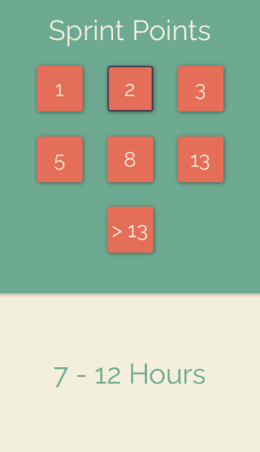
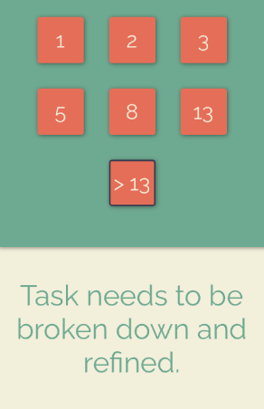

# Sprint Points Converter

A simple mobile app that allows users to quickly convert sprint points to a range of hours that can be used when adding hourly estimates to tickets.

## Screenshots




## Scripts
- Start in development mode.
```
npm run start
```
*Will provide QR code and give options to run on various devices using Expo.*
- Start on android device.
```
npm run android
```
- Start on iOS device.
```
npm run ios
```
*You might need to select a specific simulator: `shift` + `i`.*
- Start in a web browser.
```
npm run web
```

## Built With
[](https://skillicons.dev)

